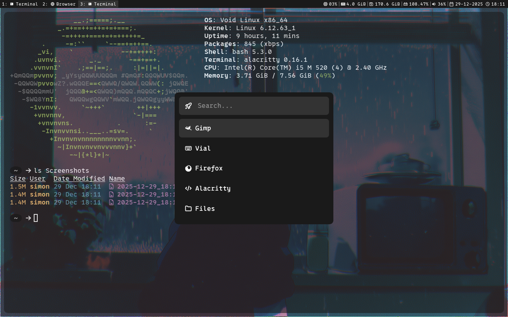

<!-- <p align="center"> -->
<!--      -->
<!-- </p> -->
  
<h1 align="center">
  <em>kast</em>
</h1>

<p align="center">
  <em>A GUI launcher for launching applications, scripts, <br>
        and .AppImage files all in the same place.</em>
</p>
  
<p align="center">
    
    
  
  
</p>
  
<p align="center">
  <a href="#features">Features</a> •
  <a href="#installation">Installation</a> •
  <a href="#controls">Controls</a> •
  <a href="#built-with">Built With</a> •
  <a href="#license">License</a>
</p>  
  
<p align="center">
  
</p>

---
<div id="features"></div>

## ✨ Features
+ ⌨️ Easy and fast keyboard operation
+ ⚡ Launch .desktop, .sh, .AppImage as well as general bin files all within a cohesive interface.
+ 🧠 Every setting is stored in a config (.toml) file, keeping your config very portable between different machines.

> [!IMPORTANT]  
> 'kast' was created exclusively for my own use on a computer running Void Linux with i3. I can't guarantee that this program will run on your computer - for the best results, clone this repo and adjust the source code to you liking!
  
---
<div id="installation"></div>

## 💻 Installation
  
**0. (Optional) Install a nerdfont**  
This program relies on the 0xProto Nerd Font for its icons (although the program works just fine without the font of course).  
[Install this font and set it as your terminal font](https://www.nerdfonts.com/font-downloads)  
  
**1. Ensure `~/.local/bin/` exists and is in your shell path**
``` bash
mkdir -p ~/.local/bin
export PATH="$HOME/.local/bin:$PATH" # add this line to your shell config
source ~/.bashrc   # source ~/.zshrc
```
  
**2. Download and install the latest release of kast**  
``` bash
curl -L -o ~/.local/bin/kast $(curl -s https://api.github.com/repos/simon-danielsson/kast-launcher/releases/latest \
| grep "browser_download_url.*kast\"" \
| cut -d '"' -f 4)
chmod +x ~/.local/bin/kast

```
  
**3. If using i3, add this line to your config to be sure the launcher is floating**
``` bash
for_window [title="kast"] floating enable
```
  
**4. Launch kast for the first time to create a ".kast" config file home directory**  
``` bash
kast
```
  
**5. Bind kast to a key in your linux config - example: 'i3/config'**
``` bash
bindsym $mod+space exec kast
```

  
**6. Done!**
  

---
<div id="controls"></div>

## 🚀 Controls
  
```
[Esc]:
Quit the program

[Space/Enter]:
Launch application

[Up/Down]:
Navigate results
```

---
<div id="built-with"></div>

## 🛠️ Built With
+ [egui](https://github.com/emilk/egui)  
+ [eframe](https://github.com/emilk/egui)  
+ [winit](https://github.com/rust-windowing/winit)  
+ [serde](https://github.com/serde-rs/serde)  
+ [toml](https://github.com/toml-rs/toml)  
+ [home](https://docs.rs/home/latest/home/)  

---
<div id="license"></div>

## 📜 License
This project is licensed under the [MIT License](https://github.com/simon-danielsson/kast/blob/main/LICENSE).  
